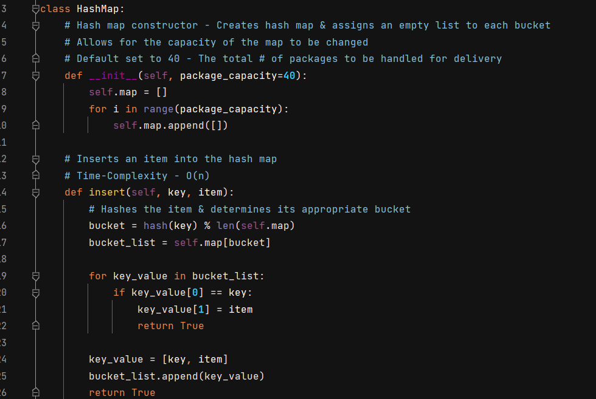
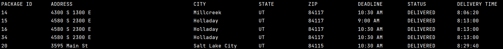
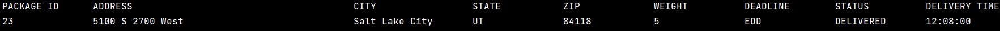
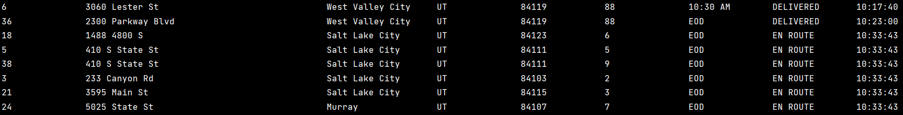

#  DELIVERY ROUTING SYSTEM 

## :clipboard: OVERVIEW
This project was the culmination of everything covered in my university exposure to ***data structures and algorithms***. The course explored the analysis and implementation of high-performance data structures and supporting algorithms, including graphs, hashing, self-adjusting data structures, set representations, and dynamic programming. It employed the Python programing language as the main way to explore these concepts and solve unique problems.

## :bar_chart: APPLICATION PURPOSE
This console application helps to solve a variant of the ***"traveling saleman problem"***. Given a
detailed list of package information, two drivers needed a quick route to make the expected deliveries in under 140 total miles traveled.
A host of issues needed to be handled including wrong addresses, specific instructions, and delivery deadlines.

The use of Python's built-in dictionary was not allowed, and so a hash map class was implemented to help organize packages and allow quick access:

Each section of code is commented with its respective time-complexity. The main algorithm for the application applies a nearest neighbor approach to determine the next delivery address. It mimics a graph-like representation using an adjacency list to hold distances (edges) that can be looked up based on the index of the address data (vertices). The delivery and distance information was parsed from the provided CSV files located in the attached _data_files_ directory.

## :computer: TECHNOLOGIES
- Python
- PyCharm (Professional 2021.2)

## :page_with_curl: SCOPE OF FUNCTIONALITIES
A user can use the console to get an overview of the route taken and find when packages were delivered. This includes searches by:

- ### End of the day: 

- ### Package ID:

 

- ### Time: 

## :bulb: LESSONS LEARNED
The course and the project showed me despite my exposure, I still have a tremendous amount to learn in the realm of data structures and algorithms. While I feel comfortable in their discussion and use, I have to continually develop my ability to apply the principles and concepts learned in order to produce creative and optimal solutions to complex problems.  

My greatest take away was that at the core of everything I hope to accomplish in the realm of software engineering, it will all boil down to problem solving. Producing clean and efficient code is an invaluable skill required for long-term success. I often have seen dicussions that the academic exploration of data structures and algorithms isn't as prevalent in the day to day activites of a software engineer. This tends to come off as though they are unimportant in the grand scheme of things and that the coding questions that have become as part of the interview process are worthless activities.  

However, the more time I devote to study within this area, the more I begin to understand their importance and application and why large companies require a firm understanding on the topic so that they can continue to produce scalable solutions.